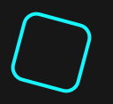

# esempi

## texture




```jsx
{/* Decorative neon shapes on black */}
<div className="absolute inset-0 pointer-events-none" aria-hidden="true">
<div
className="absolute top-10 left-10 w-20 h-20 rounded-2xl border-4 hidden lg:block"
style={{
borderColor: 'var(--color-cyan-bright)',
transform: 'rotate(15deg)',
}}
/>
<div
className="absolute top-20 right-20 w-16 h-16 rounded-full border-4 hidden lg:block"
style={{
borderColor: 'var(--color-pink-hot)',
}}
/>
<div
className="absolute bottom-10 left-1/3 w-14 h-14 border-4 hidden lg:block"
style={{
borderColor: 'var(--color-design-neon)',
transform: 'rotate(-20deg)',
}}
/>
</div>
```

## AMA illustration


```jsx
export function AMAIllustration() {
  return (
    <div className="relative w-[160px] h-[120px] lg:w-[200px] lg:h-[150px]">
      {/* Custom Illustration "Question & Idea" - Two blob shapes connected */}
      
      {/* Left Blob - Lightbulb (Yellow) */}
      <div className="absolute left-0 top-1/2 -translate-y-1/2">
        <div className="relative">
          {/* White blob shape with black border */}
          <div className="w-16 h-20 bg-white rounded-[32px] border-[3px] border-[#0F172A] shadow-[2px_2px_0px_#0F172A] flex items-center justify-center rotate-12 lg:w-20 lg:h-24">
            {/* Lightbulb icon - Yellow */}
            <svg 
              width="32" 
              height="32" 
              viewBox="0 0 24 24" 
              fill="none" 
              stroke="#EAB308" 
              strokeWidth="2.5" 
              strokeLinecap="round" 
              strokeLinejoin="round"
              className="lg:w-10 lg:h-10"
            >
              <path d="M15 14c.2-1 .7-1.7 1.5-2.5 1-.9 1.5-2.2 1.5-3.5A6 6 0 0 0 6 8c0 1 .2 2.2 1.5 3.5.7.7 1.3 1.5 1.5 2.5" />
              <path d="M9 18h6" />
              <path d="M10 22h4" />
            </svg>
          </div>
          
          {/* Small tail connector blob */}
          <div className="absolute -right-2 top-1/2 -translate-y-1/2 w-3 h-3 bg-white rounded-full border-[2px] border-[#0F172A] lg:w-3.5 lg:h-3.5" />
        </div>
      </div>
      
      {/* Right Blob - Question Mark (Red/Purple) */}
      <div className="absolute right-0 top-1/2 -translate-y-1/2">
        <div className="relative">
          {/* White blob shape with black border */}
          <div className="w-16 h-20 bg-white rounded-[32px] border-[3px] border-[#0F172A] shadow-[2px_2px_0px_#0F172A] flex items-center justify-center -rotate-12 lg:w-20 lg:h-24">
            {/* Question mark - Red/Purple */}
            <svg 
              width="32" 
              height="32" 
              viewBox="0 0 24 24" 
              fill="none"
              className="lg:w-10 lg:h-10"
            >
              {/* Question mark path */}
              <path 
                d="M9.09 9a3 3 0 0 1 5.83 1c0 2-3 3-3 3" 
                stroke="#8B5CF6" 
                strokeWidth="2.5" 
                strokeLinecap="round" 
                strokeLinejoin="round"
              />
              <circle cx="12" cy="17" r="1.5" fill="#8B5CF6" stroke="#8B5CF6" strokeWidth="1.5" />
            </svg>
          </div>
          
          {/* Small tail connector blob */}
          <div className="absolute -left-2 top-1/2 -translate-y-1/2 w-3 h-3 bg-white rounded-full border-[2px] border-[#0F172A] lg:w-3.5 lg:h-3.5" />
        </div>
      </div>
      
      {/* Connection line between blobs */}
      <div className="absolute top-1/2 left-1/2 -translate-x-1/2 -translate-y-1/2 w-8 h-1 bg-white border-y-[2px] border-[#0F172A] lg:w-10" />
      
      {/* Accent Elements - Plus signs and dots around */}
      
      {/* Plus sign - top left */}
      <div className="absolute top-2 left-6 lg:left-8">
        <div className="relative w-3 h-3 lg:w-4 lg:h-4">
          <div className="absolute inset-0 w-0.5 h-3 bg-[#84CC16] left-1/2 -translate-x-1/2 lg:h-4" />
          <div className="absolute inset-0 h-0.5 w-3 bg-[#84CC16] top-1/2 -translate-y-1/2 lg:w-4" />
        </div>
      </div>
      
      {/* Plus sign - top right */}
      <div className="absolute top-4 right-6 lg:right-8">
        <div className="relative w-2.5 h-2.5 lg:w-3 lg:h-3">
          <div className="absolute inset-0 w-0.5 h-2.5 bg-[#F97316] left-1/2 -translate-x-1/2 lg:h-3" />
          <div className="absolute inset-0 h-0.5 w-2.5 bg-[#F97316] top-1/2 -translate-y-1/2 lg:w-3" />
        </div>
      </div>
      
      {/* Dot - bottom left */}
      <div className="absolute bottom-4 left-4 w-2 h-2 bg-[#EC4899] rounded-full border-[2px] border-[#0F172A] lg:w-2.5 lg:h-2.5 lg:left-6" />
      
      {/* Dot - bottom right */}
      <div className="absolute bottom-2 right-4 w-2 h-2 bg-[#3B82F6] rounded-full border-[2px] border-[#0F172A] lg:w-2.5 lg:h-2.5 lg:right-6" />
      
      {/* Plus sign - bottom center */}
      <div className="absolute bottom-0 left-1/2 -translate-x-1/2">
        <div className="relative w-2 h-2 lg:w-2.5 lg:h-2.5">
          <div className="absolute inset-0 w-0.5 h-2 bg-[#8B5CF6] left-1/2 -translate-x-1/2 lg:h-2.5" />
          <div className="absolute inset-0 h-0.5 w-2 bg-[#8B5CF6] top-1/2 -translate-y-1/2 lg:w-2.5" />
        </div>
      </div>
    </div>
  );
}
```

## Book a call button


```jsx
<button 
                  className="w-full sm:w-auto px-8 py-4 rounded-xl font-bold text-base transition-all border-4 shadow-black group"
                  style={{
                    backgroundColor: 'var(--color-white)',
                    borderColor: 'var(--color-black)',
                    color: 'var(--color-black)',
                  }}
                  onMouseEnter={(e) => {
                    e.currentTarget.style.transform = 'translate(3px, 3px)';
                    e.currentTarget.style.boxShadow = '3px 3px 0px var(--color-black)';
                    e.currentTarget.style.backgroundColor = 'var(--color-design-neon)';
                  }}
                  onMouseLeave={(e) => {
                    e.currentTarget.style.transform = 'translate(0, 0)';
                    e.currentTarget.style.boxShadow = '6px 6px 0px var(--color-black)';
                    e.currentTarget.style.backgroundColor = 'var(--color-white)';
                  }}
                >
                  <span className="flex items-center justify-center gap-2">
                    <Calendar className="w-5 h-5" strokeWidth={3} />
                    Book a Call
                  </span>
                </button>
```

## Path morphing Framer Motion

```jsx
"use client"

import { interpolate } from "flubber"
import {
    animate,
    motion,
    MotionValue,
    useMotionValue,
    useTransform,
} from "motion/react"
import { useEffect, useState } from "react"

export default function PathMorphing() {
    const [pathIndex, setPathIndex] = useState(0)
    const progress = useMotionValue(pathIndex)
    const fill = useTransform(progress, paths.map(getIndex), colors)
    const path = useFlubber(progress, paths)

    useEffect(() => {
        const animation = animate(progress, pathIndex, {
            duration: 0.8,
            ease: "easeInOut",
            onComplete: () => {
                if (pathIndex === paths.length - 1) {
                    progress.set(0)
                    setPathIndex(1)
                } else {
                    setPathIndex(pathIndex + 1)
                }
            },
        })

        return () => animation.stop()
    }, [pathIndex, progress])

    return (
        <svg width="400" height="400">
            <g transform="translate(10 10) scale(17 17)">
                <motion.path fill={fill} d={path} />
            </g>
        </svg>
    )
}

/**
 * ==============   Utils   ================
 */

const getIndex = (_: string, index: number) => index

function useFlubber(progress: MotionValue<number>, paths: string[]) {
    return useTransform(progress, paths.map(getIndex), paths, {
        mixer: (a, b) => interpolate(a, b, { maxSegmentLength: 0.1 }),
    })
}

/**
 * ==============   Shape data   ================
 */

// Paths taken from https://github.com/veltman/flubber/blob/master/demos/basic-svg.html
const star =
    "M12 17.27L18.18 21l-1.64-7.03L22 9.24l-7.19-.61L12 2 9.19 8.63 2 9.24l5.46 4.73L5.82 21z"
const heart =
    "M12 21.35l-1.45-1.32C5.4 15.36 2 12.28 2 8.5 2 5.42 4.42 3 7.5 3c1.74 0 3.41.81 4.5 2.09C13.09 3.81 14.76 3 16.5 3 19.58 3 22 5.42 22 8.5c0 3.78-3.4 6.86-8.55 11.54L12 21.35z"
const hand =
    "M23 5.5V20c0 2.2-1.8 4-4 4h-7.3c-1.08 0-2.1-.43-2.85-1.19L1 14.83s1.26-1.23 1.3-1.25c.22-.19.49-.29.79-.29.22 0 .42.06.6.16.04.01 4.31 2.46 4.31 2.46V4c0-.83.67-1.5 1.5-1.5S11 3.17 11 4v7h1V1.5c0-.83.67-1.5 1.5-1.5S15 .67 15 1.5V11h1V2.5c0-.83.67-1.5 1.5-1.5s1.5.67 1.5 1.5V11h1V5.5c0-.83.67-1.5 1.5-1.5s1.5.67 1.5 1.5z"
const plane =
    "M21 16v-2l-8-5V3.5c0-.83-.67-1.5-1.5-1.5S10 2.67 10 3.5V9l-8 5v2l8-2.5V19l-2 1.5V22l3.5-1 3.5 1v-1.5L13 19v-5.5l8 2.5z"
const lightning = "M7 2v11h3v9l7-12h-4l4-8z"
const note =
    "M12 3v10.55c-.59-.34-1.27-.55-2-.55-2.21 0-4 1.79-4 4s1.79 4 4 4 4-1.79 4-4V7h4V3h-6z"

const paths = [lightning, hand, plane, heart, note, star, lightning]
const colors = [
    "#fff312",
    "#ff0088",
    "#dd00ee",
    "#9911ff",
    "#0d63f8",
    "#0cdcf7",
    "#4ff0b7",
]
```

## scroll to trigger

```jsx
import * as motion from "motion/react-client"
import type { Variants } from "motion/react"

export default function ScrollTriggered() {
    return (
        <div style={container}>
            {food.map(([emoji, hueA, hueB], i) => (
                <Card i={i} emoji={emoji} hueA={hueA} hueB={hueB} key={emoji} />
            ))}
        </div>
    )
}

interface CardProps {
    emoji: string
    hueA: number
    hueB: number
    i: number
}

function Card({ emoji, hueA, hueB, i }: CardProps) {
    const background = `linear-gradient(306deg, ${hue(hueA)}, ${hue(hueB)})`

    return (
        <motion.div
            className={`card-container-${i}`}
            style={cardContainer}
            initial="offscreen"
            whileInView="onscreen"
            viewport={{ amount: 0.8 }}
        >
            <div style={{ ...splash, background }} />
            <motion.div style={card} variants={cardVariants} className="card">
                {emoji}
            </motion.div>
        </motion.div>
    )
}

const cardVariants: Variants = {
    offscreen: {
        y: 300,
    },
    onscreen: {
        y: 50,
        rotate: -10,
        transition: {
            type: "spring",
            bounce: 0.4,
            duration: 0.8,
        },
    },
}

const hue = (h: number) => `hsl(${h}, 100%, 50%)`

/**
 * ==============   Styles   ================
 */

const container: React.CSSProperties = {
    margin: "100px auto",
    maxWidth: 500,
    paddingBottom: 100,
    width: "100%",
}

const cardContainer: React.CSSProperties = {
    overflow: "hidden",
    display: "flex",
    justifyContent: "center",
    alignItems: "center",
    position: "relative",
    paddingTop: 20,
    marginBottom: -120,
}

const splash: React.CSSProperties = {
    position: "absolute",
    top: 0,
    left: 0,
    right: 0,
    bottom: 0,
    clipPath: `path("M 0 303.5 C 0 292.454 8.995 285.101 20 283.5 L 460 219.5 C 470.085 218.033 480 228.454 480 239.5 L 500 430 C 500 441.046 491.046 450 480 450 L 20 450 C 8.954 450 0 441.046 0 430 Z")`,
}

const card: React.CSSProperties = {
    fontSize: 164,
    width: 300,
    height: 430,
    display: "flex",
    justifyContent: "center",
    alignItems: "center",
    borderRadius: 20,
    background: "#f5f5f5",
    boxShadow:
        "0 0 1px hsl(0deg 0% 0% / 0.075), 0 0 2px hsl(0deg 0% 0% / 0.075), 0 0 4px hsl(0deg 0% 0% / 0.075), 0 0 8px hsl(0deg 0% 0% / 0.075), 0 0 16px hsl(0deg 0% 0% / 0.075)",
    transformOrigin: "10% 60%",
}

/**
 * ==============   Data   ================
 */

const food: [string, number, number][] = [
    ["🍅", 340, 10],
    ["🍊", 20, 40],
    ["🍋", 60, 90],
    ["🍐", 80, 120],
    ["🍏", 100, 140],
    ["🫐", 205, 245],
    ["🍆", 260, 290],
    ["🍇", 290, 320],
]
```

## scroll linked with spring

```jsx
"use client"

import { motion, useSpring, useScroll } from "motion/react"

export default function ScrollLinked() {
    const { scrollYProgress } = useScroll()
    const scaleX = useSpring(scrollYProgress, {
        stiffness: 100,
        damping: 30,
        restDelta: 0.001,
    })

    return (
        <>
            <motion.div
                id="scroll-indicator"
                style={{
                    scaleX,
                    position: "fixed",
                    top: 0,
                    left: 0,
                    right: 0,
                    height: 10,
                    originX: 0,
                    backgroundColor: "#ff0088",
                }}
            />
            <Content />
        </>
    )
}

/**
 * ==============   Utils   ================
 */

function Content() {
    return (
        <>
            <article style={{ maxWidth: 500, padding: "150px 20px" }}>
                <p>
                    Lorem ipsum dolor sit amet, consectetur adipiscing elit.
                    Aliquam ac rhoncus quam.
                </p>
                <p>
                    Fringilla quam urna. Cras turpis elit, euismod eget ligula
                    quis, imperdiet sagittis justo. In viverra fermentum ex ac
                    vestibulum. Aliquam eleifend nunc a luctus porta. Mauris
                    laoreet augue ut felis blandit, at iaculis odio ultrices.
                    Nulla facilisi. Vestibulum cursus ipsum tellus, eu tincidunt
                    neque tincidunt a.
                </p>
                <h2>Sub-header</h2>
                <p>
                    In eget sodales arcu, consectetur efficitur metus. Duis
                    efficitur tincidunt odio, sit amet laoreet massa fringilla
                    eu.
                </p>
                <p>
                    Pellentesque id lacus pulvinar elit pulvinar pretium ac non
                    urna. Mauris id mauris vel arcu commodo venenatis. Aliquam
                    eu risus arcu. Proin sit amet lacus mollis, semper massa ut,
                    rutrum mi.
                </p>
                <p>
                    Sed sem nisi, luctus consequat ligula in, congue sodales
                    nisl.
                </p>
                <p>
                    Vestibulum bibendum at erat sit amet pulvinar. Pellentesque
                    pharetra leo vitae tristique rutrum. Donec ut volutpat ante,
                    ut suscipit leo.
                </p>
                <h2>Sub-header</h2>
                <p>
                    Maecenas quis elementum nulla, in lacinia nisl. Ut rutrum
                    fringilla aliquet. Pellentesque auctor vehicula malesuada.
                    Aliquam id feugiat sem, sit amet tempor nulla. Quisque
                    fermentum felis faucibus, vehicula metus ac, interdum nibh.
                    Curabitur vitae convallis ligula. Integer ac enim vel felis
                    pharetra laoreet. Interdum et malesuada fames ac ante ipsum
                    primis in faucibus. Pellentesque hendrerit ac augue quis
                    pretium.
                </p>
                <p>
                    Morbi ut scelerisque nibh. Integer auctor, massa non dictum
                    tristique, elit metus efficitur elit, ac pretium sapien nisl
                    nec ante. In et ex ultricies, mollis mi in, euismod dolor.
                </p>
                <p>Quisque convallis ligula non magna efficitur tincidunt.</p>
                <p>
                    Pellentesque id lacus pulvinar elit pulvinar pretium ac non
                    urna. Mauris id mauris vel arcu commodo venenatis. Aliquam
                    eu risus arcu. Proin sit amet lacus mollis, semper massa ut,
                    rutrum mi.
                </p>
                <p>
                    Sed sem nisi, luctus consequat ligula in, congue sodales
                    nisl.
                </p>
                <p>
                    Vestibulum bibendum at erat sit amet pulvinar. Pellentesque
                    pharetra leo vitae tristique rutrum. Donec ut volutpat ante,
                    ut suscipit leo.
                </p>
                <h2>Sub-header</h2>
                <p>
                    Maecenas quis elementum nulla, in lacinia nisl. Ut rutrum
                    fringilla aliquet. Pellentesque auctor vehicula malesuada.
                    Aliquam id feugiat sem, sit amet tempor nulla. Quisque
                    fermentum felis faucibus, vehicula metus ac, interdum nibh.
                    Curabitur vitae convallis ligula. Integer ac enim vel felis
                    pharetra laoreet. Interdum et malesuada fames ac ante ipsum
                    primis in faucibus. Pellentesque hendrerit ac augue quis
                    pretium.
                </p>
                <p>
                    Morbi ut scelerisque nibh. Integer auctor, massa non dictum
                    tristique, elit metus efficitur elit, ac pretium sapien nisl
                    nec ante. In et ex ultricies, mollis mi in, euismod dolor.
                </p>
                <p>Quisque convallis ligula non magna efficitur tincidunt.</p>
                <p>
                    Lorem ipsum dolor sit amet, consectetur adipiscing elit.
                    Aliquam ac rhoncus quam.
                </p>
                <p>
                    Fringilla quam urna. Cras turpis elit, euismod eget ligula
                    quis, imperdiet sagittis justo. In viverra fermentum ex ac
                    vestibulum. Aliquam eleifend nunc a luctus porta. Mauris
                    laoreet augue ut felis blandit, at iaculis odio ultrices.
                    Nulla facilisi. Vestibulum cursus ipsum tellus, eu tincidunt
                    neque tincidunt a.
                </p>
                <h2>Sub-header</h2>
                <p>
                    In eget sodales arcu, consectetur efficitur metus. Duis
                    efficitur tincidunt odio, sit amet laoreet massa fringilla
                    eu.
                </p>
                <p>
                    Pellentesque id lacus pulvinar elit pulvinar pretium ac non
                    urna. Mauris id mauris vel arcu commodo venenatis. Aliquam
                    eu risus arcu. Proin sit amet lacus mollis, semper massa ut,
                    rutrum mi.
                </p>
                <p>
                    Sed sem nisi, luctus consequat ligula in, congue sodales
                    nisl.
                </p>
                <p>
                    Vestibulum bibendum at erat sit amet pulvinar. Pellentesque
                    pharetra leo vitae tristique rutrum. Donec ut volutpat ante,
                    ut suscipit leo.
                </p>
                <h2>Sub-header</h2>
                <p>
                    Maecenas quis elementum nulla, in lacinia nisl. Ut rutrum
                    fringilla aliquet. Pellentesque auctor vehicula malesuada.
                    Aliquam id feugiat sem, sit amet tempor nulla. Quisque
                    fermentum felis faucibus, vehicula metus ac, interdum nibh.
                    Curabitur vitae convallis ligula. Integer ac enim vel felis
                    pharetra laoreet. Interdum et malesuada fames ac ante ipsum
                    primis in faucibus. Pellentesque hendrerit ac augue quis
                    pretium.
                </p>
                <p>
                    Morbi ut scelerisque nibh. Integer auctor, massa non dictum
                    tristique, elit metus efficitur elit, ac pretium sapien nisl
                    nec ante. In et ex ultricies, mollis mi in, euismod dolor.
                </p>
                <p>Quisque convallis ligula non magna efficitur tincidunt.</p>
                <p>
                    Pellentesque id lacus pulvinar elit pulvinar pretium ac non
                    urna. Mauris id mauris vel arcu commodo venenatis. Aliquam
                    eu risus arcu. Proin sit amet lacus mollis, semper massa ut,
                    rutrum mi.
                </p>
                <p>
                    Sed sem nisi, luctus consequat ligula in, congue sodales
                    nisl.
                </p>
                <p>
                    Vestibulum bibendum at erat sit amet pulvinar. Pellentesque
                    pharetra leo vitae tristique rutrum. Donec ut volutpat ante,
                    ut suscipit leo.
                </p>
                <h2>Sub-header</h2>
                <p>
                    Maecenas quis elementum nulla, in lacinia nisl. Ut rutrum
                    fringilla aliquet. Pellentesque auctor vehicula malesuada.
                    Aliquam id feugiat sem, sit amet tempor nulla. Quisque
                    fermentum felis faucibus, vehicula metus ac, interdum nibh.
                    Curabitur vitae convallis ligula. Integer ac enim vel felis
                    pharetra laoreet. Interdum et malesuada fames ac ante ipsum
                    primis in faucibus. Pellentesque hendrerit ac augue quis
                    pretium.
                </p>
                <p>
                    Morbi ut scelerisque nibh. Integer auctor, massa non dictum
                    tristique, elit metus efficitur elit, ac pretium sapien nisl
                    nec ante. In et ex ultricies, mollis mi in, euismod dolor.
                </p>
                <p>Quisque convallis ligula non magna efficitur tincidunt.</p>
            </article>
        </>
    )
}
```

## parallax

```jsx
"use client"

import {
    motion,
    MotionValue,
    useScroll,
    useSpring,
    useTransform,
} from "motion/react"
import { useRef } from "react"

function useParallax(value: MotionValue<number>, distance: number) {
    return useTransform(value, [0, 1], [-distance, distance])
}

function Image({ id }: { id: number }) {
    const ref = useRef(null)
    const { scrollYProgress } = useScroll({ target: ref })
    const y = useParallax(scrollYProgress, 300)

    return (
        <section className="img-container">
            <div ref={ref}>
                
            </div>
            <motion.h2
                // Hide until scroll progress is measured
                initial={{ visibility: "hidden" }}
                animate={{ visibility: "visible" }}
                style={{ y }}
            >{`#00${id}`}</motion.h2>
        </section>
    )
}

export default function Parallax() {
    const { scrollYProgress } = useScroll()
    const scaleX = useSpring(scrollYProgress, {
        stiffness: 100,
        damping: 30,
        restDelta: 0.001,
    })

    return (
        <div id="example">
            {[1, 2, 3, 4, 5].map((image) => (
                <Image key={image} id={image} />
            ))}
            <motion.div className="progress" style={{ scaleX }} />
            <StyleSheet />
        </div>
    )
}

/**
 * ==============   Styles   ================
 */

function StyleSheet() {
    return (
        <style>{`
        html {
            scroll-snap-type: y mandatory;
        }

        .img-container {
            height: 100vh;
            scroll-snap-align: start;
            display: flex;
            justify-content: center;
            align-items: center;
            position: relative;
        }

        .img-container > div {
            width: 300px;
            height: 400px;
            margin: 20px;
            background: #f5f5f5;
            overflow: hidden;
        }

        .img-container img {
            width: 300px;
            height: 400px;
        }

        @media (max-width: 500px) {
            .img-container > div {
                width: 150px;
                height: 200px;
            }

            .img-container img {
                width: 150px;
                height: 200px;
            }
        }

        .img-container h2 {
            color: #8df0cc;
            margin: 0;
            font-family: "Azeret Mono", monospace;
            font-size: 50px;
            font-weight: 700;
            letter-spacing: -3px;
            line-height: 1.2;
            position: absolute;
            display: inline-block;
            top: calc(50% - 25px);
            left: calc(50% + 120px);
        }

        .progress {
            position: fixed;
            left: 0;
            right: 0;
            height: 5px;
            background: #8df0cc;
            bottom: 50px;
            transform: scaleX(0);
        }
    `}</style>
    )
}
```

## Layout animation

```jsx
"use client"

import * as motion from "motion/react-client"
import { useState } from "react"

export default function LayoutAnimation() {
    const [isOn, setIsOn] = useState(false)

    const toggleSwitch = () => setIsOn(!isOn)

    return (
        <button
            className="toggle-container"
            style={{
                ...container,
                justifyContent: "flex-" + (isOn ? "start" : "end"),
            }}
            onClick={toggleSwitch}
        >
            <motion.div
                className="toggle-handle"
                style={handle}
                layout
                transition={{
                    type: "spring",
                    visualDuration: 0.2,
                    bounce: 0.2,
                }}
            />
        </button>
    )
}

/**
 * ==============   Styles   ================
 */

const container = {
    width: 100,
    height: 50,
    backgroundColor: "var(--hue-3-transparent)",
    borderRadius: 50,
    cursor: "pointer",
    display: "flex",
    padding: 10,
}

const handle = {
    width: 50,
    height: 50,
    backgroundColor: "#9911ff",
    borderRadius: "50%",
}
```